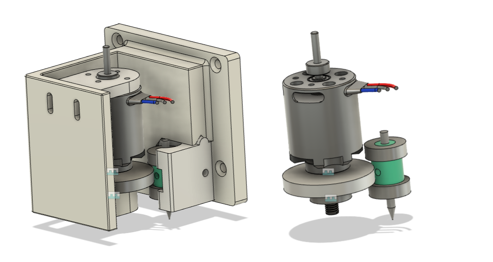

# Spindles

A machine tool starts with the tool and finding/building a reliable micro spindle for PCB milling has been a challenge. I'm detailing the various ways I'm trying to solve this challenge. All of them have certain quirks and work to varying degrees.

### #1 Modella Spindle (design only)

One way to couple to an existing modella spindle block using a 2207 BLDC motor. The motor is on a compliant element to prevent overconstrain. Abandoned as the availability of Modella spindles are subject to question.

### #2 Sans Modella spindle (attempted)

 
An attempt to make a Modella style spindle with a precision shaft and bearings on a 3D printed frame. The motor couples with a flexible coupling

1. Difficult make [small diameter shafts](Images/spindle/lathe1.jpg) on a lathe.
2. **Aligning bearings** without an arbor press is difficult.

### #3 ETC spindle (in-progress | ~viable)

<iframe src="https://gmail1728488.autodesk360.com/shares/public/SH35dfcQT936092f0e4309f470c9e5330254?mode=embed" width="640" height="480" allowfullscreen="true" webkitallowfullscreen="true" mozallowfullscreen="true"  frameborder="0"></iframe>

[Design ETC/microR8](Images/spindle/ETC Spindle v31.zip)

Easy Tool changer spindle, a design to see if we can skip the precision shaft and use the shank of the end mill to hold it. 

It is **Friction drive based**, large gear ratios, the bit holder clamps to the endmill with screws, bearings on both sides, 3D printed frame with motor on a flexure to provide preload.

Bit carriage is kinematically constrained to frame and fixed with one bolt. 

1. Need to **explore materials** on the friction drive, Aluminum|Aluminum, Polyurethane wheel.

### #4 Micro R8 (in-progress | ~viable)

<iframe src="https://gmail1728488.autodesk360.com/shares/public/SH35dfcQT936092f0e430994abb8b55dc409?mode=embed" width="640" height="480" allowfullscreen="true" webkitallowfullscreen="true" mozallowfullscreen="true"  frameborder="0"></iframe>

[Design ETC/microR8](Images/spindle/ETC Spindle v31.zip)

Inspired by the R8 Tool holder, this is an attempt at using the motor's integrated screw thread to hold on to a 3D printed chuck.

A large bearing in the base to take up all the cutting forces. The 3D printed frame holds everything in place.

The 3D printed frame which holds the large bearing and the collar which attached to the motor.

The 2216 motor mounted to the frame on the top.

Fully assembled spindle

<video height="520" autoplay muted loop>
  <source src="../Images/spindle/micror8.mp4" type="video/mp4">
Your browser does not support the video tag.
</video>

1. Dependent on quality of 3D printer to create concentric parts
2. Ways to prevent motor overconstrain.
3. larger bearings are rated for lower RPMs.

 This work is licensed under a <a rel="license" href="http://creativecommons.org/licenses/by-sa/4.0/">Creative Commons Attribution-ShareAlike 4.0 International License</a>.

